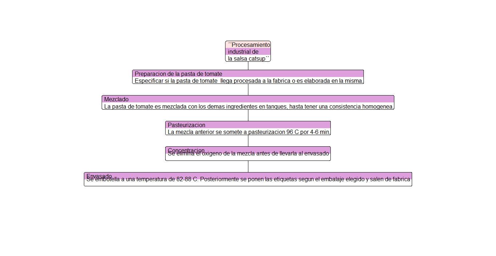
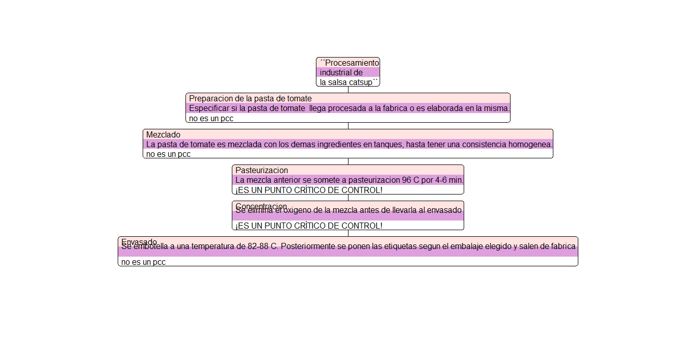

```{r setup, include=FALSE}
knitr::opts_chunk$set(echo = TRUE)
```

## Proceso industrial de la salsa catsup 

```**El sistema de análisis de peligros y puntos críticos de control (HACCP) **```,  es un sistema implementado para identificar los puntos del proceso en donde se detectan peligros y establecer medidas de control.
Su objetivo es disminuir o eliminar la posibilidad de desarrollo, supervivencia o contaminación con microorganismos inaceptables, así como mejorar el uso y aprovechamiento de los recursos.

El siguiente es un reporte de analisis de peligros ```**(PC)**``` tanto como para las materias primas implementadas como para cada una de las etapas del proceso y el establecimiento de los puntos criticos de 
control que se encuentran dentro del procesamiento industrial de la salsa catsup. 

Este reporte es elaborado con el programa "R" y cuenta con funciones creadas específicamente  para analizar las caracteristicas de la materia prima y etapas del proceso bajo los parámetros establecidos por el sistema HACCP. 

## Diagrama de flujo del proceso 
Este diagrama fue elaborado a través de funciones y paquetes de R, sin embargo el Rmarkdown no reconoció algunas funciones y preferí quitar el código y anexar la imagen. 
 
 
## Análisis de materia prima

El analisis de los peligros en el uso de la materia prima que se requiere en el proceso, evaluados como puntos de control, fue hecho por la siguiente funcion: 

```{r}
funcion_lista<- function(materia){
  seguir<- 1
  while (seguir == 1){
    message("Selecciona el número de tu elemento de ínteres:")
    suma=0 
    for(i in seq_along(materia)) {
      suma<- 1:i 
    }
    names(materia)<-suma
    ls<- print (materia)
    m<-readline("El análisis se hará para:")
    m<- as.numeric(m)
    for(i in m) { cat (materia[c(i)])
    }
    message("Responde las siguientes preguntas con 1=sí, 0=No")
    ##con los siguientes comandos condicionales hago el analisis de riesgos para cada 
    #ingrediente según lo establecido en los lineamientos HCCP y así determinar si 
    #hay algún punto crítico en nuestros ingredientes 
    p1<- readline("¿Puede contener peligro microbiologico a niveles riesgoso para el consumidor? ") 
    p1<-as.numeric(p1) 
    
    if (p1 == 0){ 
      cat( "No es un punto crítico")
    } else if (p1 == 1) { 
      cat (p2<-readline(prompt="Incluido el uso correcto por el consumidor, ¿Puede el procesado 
             garantizar la eliminación o reducción del peligro hasta niveles aceptables o seguros?"))
      p2<-as.numeric(p2)
      if (p2 == 0) cat("No es un punto crítico")
      if (p2==1) cat( "¡¡ES UN PUNTO CRÍTICO!!!") }
    seguir<- readline(prompt = "¿Desea evaluar otro ingrediente?")
    seguir<- as.numeric(seguir)}}

```
Psoteriormente se creo una lista de la materia prima y cada punto fue sometido al analisis. 

``` {r, echo = FALSE}
mp<- read.csv("materia_prima.csv")
matriz<-as.matrix(mp)
materia<- as.vector(matriz[,1])
materia ### mi lista ahora es un vector que puedo ingresar a mi funcion lista 

#####################funcion lista######
##En cada paso del bucle reemplazar la columna que corresponda:
# CP<- lapply(materia, funcion_lista2) ##funcion interactiva 
PC<-c ("¡¡ES UN PUNTO CRÍTICO!!!", "No es un punto crítico", "No es un punto crítico", 
       "No es un punto crítico", "No es un punto crítico", "No es un punto crítico", 
       "No es un punto crítico", "No es un punto crítico") 
#este vector se llena manual a partir de los resultados ya que el objeto que resulta de la funcion es de clase NULL
```
A continuación se muestran los resultados: 
```{r, echo=FALSE}
materia <-  cbind(materia, PC)##A mi vector materia le añado el vector de resultados 
reporte<- as.table(materia)#Creo una tabla que se puede usar en un reporte 
print (reporte)
```

## Análisis de puntos críticos (PC) en el proceso

Esta función es similar a la "funcion lista" pero ahora analizaremos la información contenida en el diagrama de flujo. 
En este caso el objeto al que se aplicará la función será a la base de datos utilizada para trazar el diagrama de flujo, tomando solamente la lista que contiene el nombre de las etapas del proceso. 

```{r}

etapas<-read.csv("proceso.csv")
etapas<-as.matrix(etapas)
etapas<-as.vector(etapas[,2])
etapas

fabricacion<- function(etapas)
  {
  seguir<- 1
  while (seguir == 1){
    message("Selecciona el número de tu elemento de ínteres:")
    suma=0 
    for(i in seq_along(etapas)) {
      suma<- 1:i 
    }
    names(etapas)<-suma
    ls<- print (etapas)
    m<-readline("El análisis se hará para:")
    m<- as.numeric(m)
    for(i in m) { cat (etapas[c(i)])
    } 
    message("Responde las siguientes preguntas con 1=sí, 0=No")
  p1<- readline("¿Puede permitir esta etapa la contaminación con el agente del peligro considerado,
                 o permite que este aumente hasta niveles nocivos ? ")
  p1<-as.numeric(p1) 
  if (p1 == 0) { cat (p3<-readline("¿Se pretende con esta etapa inhibir o prevenir la contaminación y/o 
                 el aumento de peligro hasta niveles nocivos?"))
    p3<-as.numeric(p3)
  if(p3==0) cat("no es un punto crítico\n")
  if (p3==1) cat("¡ES UN PUNTO CRÍTICO!\n")
   } else if (p1 == 1) {cat (p2<- readline("Incluido el uso correcto por el consumidor, ¿Garantiza el    proceso posterior, la eliminación del peligro o su reducción hasta niveles seguros?"))
  p2<- as.numeric(p2)
  if (p2==0) cat("no es un punto crítico\n")
  if (p2==1) cat("¡ES UN PUNTO CRÍTICO!\n")}
  seguir<- readline(prompt = "¿Desea evaluar otro ingrediente?")
  seguir<- as.numeric(seguir)}
  }
```
A continuación se muestran los resultados del análisis: 

```{r, echo=FALSE}
#fabricacion(etapas)
## analizo cada una de mis etapas con la funcion interactiva 
PCF<- c("no es un punto crítico","¡ES UN PUNTO CRÍTICO!","¡ES UN PUNTO CRÍTICO!", 
       "¡ES UN PUNTO CRÍTICO!", "no es un punto crítico")# creo una lista con los resultados de esa funcion

##creo una tabla con la lista del analisis y sus resultados 
resultados<- cbind(etapas,PCF)
resultados<- as.table(resultados)
print (resultados)
```

## Análsiis de puntos críticos de control (PCC) en el proceso 

Un punto critico de control (PCC), es la fase en donde las fallas podrian causar daños serios a los clientes o el negocio, y enh donde aplicar un control es posible y escencial. 

Con base en la siguiente funcion ("pcc") hicimos un análisis de los peligros detectados con las funciones anteriores y encontramos las fases que requieren un control eficaz dentro del proceso para disminuir el peligro de contaminación del producto. 

```{r}
pcc<- function(){
  seguir<- 1
  while (seguir == 1){
  message("interactive: ", interactive()) 
  f1 <- readline("Ingresa el nombre del paso de fabricación a evaluar: ") 
  message("A continuación determinaremos los puntos críticos de control a partir de los pc identificados")
  message("Responde las siguientes preguntas con 1=sí, 0=No")
  
  p1<- readline("¿Existen medidas preventivas para el preligro identificado?")
  p1<- as.numeric(p1)
  if (p1==0) { cat (p5<-readline ("¿Es necesario el control en este paso para seguridad?"))
   p5<-as.numeric (p5)
if (p5==0) cat (f1, "no es un punto crítico de control")
if (p5 == 1) cat("Investigar oportunidad de mejorar el paso/proceso/producto")
   } else if (p1==1){ cat (p2<- readline("En este paso ¿Está(s) medida(s) preventivas eliminan o reducen la probabilidad 
              de ocurrencia de peligro a un nivel aceptable?"))
p2<-as.numeric(p2)
if (p2==1) cat (f1, "¡ES UN PUNTO CRÍTICO DE CONTROL!")
} else if (p2==0) { cat( p3<- readline("¿Puede la pérdida de control de este paso contribuir o causar posteriormente una falla
              o podrían estos incrementar a niveles aceptables?"))
    p3<- as.numeric(p3)
    if (p3==0) cat (f1, "no es un punto crítico de control") 
} else if (p3==1) {cat (p4<-readline("¿Podría un paso posterior eliminar el peligro identificado o reducir su ocurrencia 
              a un nivel aceptable?"))
p4<- as.numeric(p4)
if (p4== 1) cat (f1, "no es un punto crítico de control") 
if (p4 == 0) cat (f1, "¡ES UN PUNTO CRÍTICO DE CONTROL!")}
seguir<- readline(prompt = "¿Desea evaluar otro punto crítico?")
seguir<- as.numeric(seguir)}}
```

```**Puntos críticos de control detectados**```

```{r, echo=FALSE}
#creé dos vectores que contenian el punto a evaluar y el resultado del análisis 
paso<-c("Concentrado de tomate", " Mezclado ", "Pasteurizacion", "Concentracion")
  ptoCC<- c("no es un punto crítico de control", "no es un punto crítico de control",
            "¡ES UN PUNTO CRÍTICO DE CONTROL!", "¡ES UN PUNTO CRÍTICO DE CONTROL!")
  res<- cbind(paso, ptoCC)
  res<-as.table(res)
  print (res)
``` 

## Diagrama de flujo con los PCC detectados  

```*Esto se realizó en el script de diagrama de flujo debido a los errores para correr la funcion del diagrama de flujo en Rmarkdown.*```


